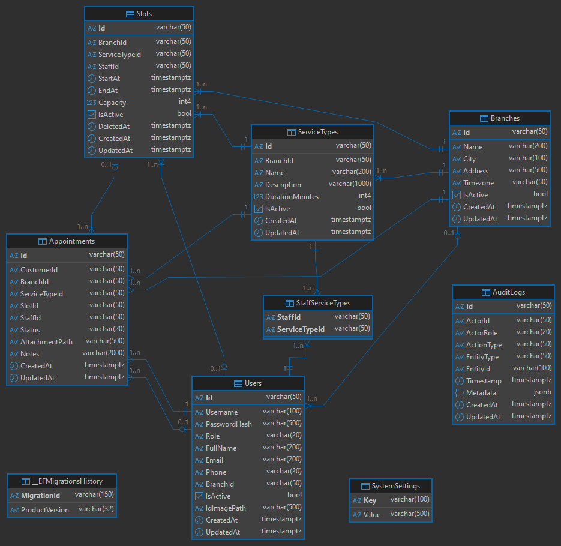

# FlowCare API

FlowCare is a backend API for the **Rihal Codestacker 2026** challenge.

It provides a role-based queue and appointment booking system for multi-branch operations, with strong auditability, soft-delete lifecycle management, and secure file handling.

## Project Scope

This implementation covers the required backend domain:

- Branches, service types, slots, staff, customers, appointments, and audit logs
- Basic Authentication with role-based authorization
- Public browsing of branches, services, and available slots
- Customer booking, cancellation, and rescheduling
- Staff, manager, and admin operational flows
- Slot soft-delete with retention and hard cleanup
- Startup seed import (idempotent)
- File upload and retrieval permissions for ID images and appointment attachments
- PostgreSQL with Entity Framework Core migrations

## Tech Stack

- .NET 10 (ASP.NET Core Web API)
- Entity Framework Core with Npgsql provider
- PostgreSQL
- Basic Auth (custom authentication handler)
- BCrypt password hashing
- CSV export using CsvHelper
- OpenAPI with Scalar API reference UI
- Docker and Docker Compose

## Project Structure

### Clean Architecture API

The app follows Clean Architecture:

- `src/FlowCare.Api`: Web API layer (controllers, middleware, startup)
- `src/FlowCare.Application`: DTOs and service contracts
- `src/FlowCare.Domain`: Entities and enums
- `src/FlowCare.Infrastructure`: EF Core, auth, services, seeding, background jobs, migrations

```md
    ┌───────────────────────────────────────────────────────────────┐
    │                           API Layer                           │
    │                                                               │
    │                Controllers, Endpoints, Uploads                │
    └─────────────┬────────────────────────────────┬────────────────┘
                  │                                │
                  │ depends on                     │ depends on
                  ▼                                ▼
    ┌──────────────────────────┐         ┌──────────────────────────┐
    │   Application Layer      │ depends │   Infrastructure Layer   │
    │                          │   on    │                          │
    │                          │ ◄────── │                          │
    │   DTOs, Interfaces       │         │ Database, Auth,          │
    │                          │         │ Services, Background Job │
    └──────────────┬───────────┘         └─────────┬────────────────┘
                   │                               │
                   │ depends on                    │ depends on
                   ▼                               ▼
    ┌───────────────────────────────────────────────────────────────┐
    │                         Domain Layer                          │
    │                            (Core)                             │
    │                                                               │
    │                        Entities, Enums                        │
    │                        NO DEPENDENCIES                        │
    └───────────────────────────────────────────────────────────────┘

Dependency Flow:
═══════════════
API Layer → Application + Infrastructure
Infrastructure → Application + Domain
Application → Domain
Domain → None (Pure entities)
```

### Database

Database schema is defined via EF Core code-first approach with migrations. ERD of the database schema:



> [!NOTE]
> I chose varchar IDs for entities to follow the provided seed data structure, but in a production system it would be recommended to use GUIDs or auto-increment integers primary keys for better performance and indexing.

## Docs

| Document | Content |
| --------- | -------- |
| [Challenge Requirements Coverage](docs/Challenge-Requirements-Coverage.md) | All mandatory and bonus requirements is implemented |
| [API Endpoints](docs/API-Endpoints.md) | List of all API endpoints |
| [Auth and Test Requests](docs/Auth-and-Test-Requests.md) | Auth request header and seeded demo accounts |
| [Technical Details](docs/Technical-Details.md) | Implementation details for pagination, file handling, soft delete, audit logging, and seeding |

## Configuration

Key settings ([appsettings.json](./src/FlowCare.Api/appsettings.json) / environment variables):

| Key | Purpose | Default |
| --- | --- | --- |
| ConnectionStrings__DefaultConnection | PostgreSQL connection string | Host=localhost;Database=FlowCareDb;Username=postgres;Password=postgres |
| SeedDataPath | Seed JSON path | ../FlowCare.Infrastructure/Data/Seed/example.json |
| FileStorage__BasePath | Upload root path | uploads |
| CleanupWorker__Enabled | Background cleanup toggle | true |
| CleanupWorker__IntervalMinutes | Background cleanup interval | 60 |
| ApiDocs__EnableInProduction | Expose docs outside development | true |

> In .NET, double underscore `__` is used to represent nested configuration sections.

## Run Locally

Prerequisites:

- .NET SDK 10
- PostgreSQL running locally

1. Clone the repository

    ```bash
    git clone https://github.com/0xKa/FlowCare.git
    ```

1. From repository root, restore and build the solution

    ```bash
    dotnet restore
    dotnet build FlowCare.slnx
    ```

1. Ensure connection string is valid in [src/FlowCare.Api/appsettings.json](./src/FlowCare.Api/appsettings.json), Database will be created automatically on startup if it doesn't exist.

- Default connection string: `Host=localhost;Database=FlowCareDb;Username=postgres;Password=postgres`

1. Run API

    ```bash
    dotnet run --project ./src/FlowCare.Api -lp https
    ```

Development profile URLs are defined in launch settings:

- HTTP: <http://localhost:5031>
- HTTPS: <https://localhost:7293> (you may need to trust the development certificate for your OS to avoid browser warnings)

Scalar UI:

- <http://localhost:5031/scalar/v1>
- <https://localhost:7293/scalar/v1>

The app applies migrations and imports seed data automatically on startup.

## Run With Docker Compose

Running with Docker Compose is recommended as it provides a consistent environment with PostgreSQL and the API running in containers.

From repository root:

  ```bash
  docker compose up --build
  ```

Services:

- API: <http://localhost:8080>
- Scalar UI: <http://localhost:8080/scalar>
- PostgreSQL: localhost:5432

Stop services:

  ```bash
  docker compose down
  ```

remove volumes too:

  ```bash
  docker compose down -v
  ```

## Testing API

**Scalar**: You can test the API using Scalar UI at `/scalar/v1` (check [Auth and Test Requests](docs/Auth-and-Test-Requests.md) for authentication details and seeded accounts).

**Postman**: You can import the provided Postman collection in [postman/FlowCare-API.postman_collection.json](./postman/FlowCare-API.postman_collection.json) for pre-configured requests.

- Make sure to also import the environment variables from [postman/environments](./postman/environments).

## Bonus: Deployment

The API is deployed on **Render** with PostgreSQL hosted on **Neon**, and **endpoints can be tested live using Scalar UI**.

**Live Service:** <https://flowcare-api-9wp2.onrender.com>

**API Documentation:** <https://flowcare-api-9wp2.onrender.com/scalar/> (You can send requests directly using Scalar UI)

### Deployment Setup

The deployment uses Docker with GitHub integration:

- Docker image is built and deployed automatically from the GitHub repository
- Render pulls the Docker image on push to the main branch
- Environment variables are configured in Render dashboard

### Database (Neon)

The PostgreSQL database is hosted on Neon with automatic migrations applied at startup. Database backups can be configured in Neon dashboard.

### Notes

- The service is deployed on Render's free Hobby plan. Services may spin down after 15 minutes of inactivity and take 30-50 seconds to wake up on the next request.
- All API documentation and Scalar UI are available at the live endpoint
- File uploads are stored on the local filesystem in the Render environment, which is ephemeral (Hobby plan limitations).
- Basic Auth is stateless, clients must send Authorization header (Base64-encoded username:password) on each request when requesting protected endpoints.

## Final Notes

- Build passes for all projects in the solution.
- Migrations are included and startup migration is enabled.
- Seeding is idempotent and automatically runs at startup.
- Role and branch constraints are enforced at service level.
- Soft-delete and audit requirements are implemented, including cleanup and CSV export.
- Uploaded files are stored on local filesystem; in containerized deployments use persistent volumes.
- Slot times are stored in UTC for multi-region/timezone support.
- Scalar UI Documentation is available at `/scalar/v1` for interactive testing of endpoints (authentication header required for protected endpoints).
